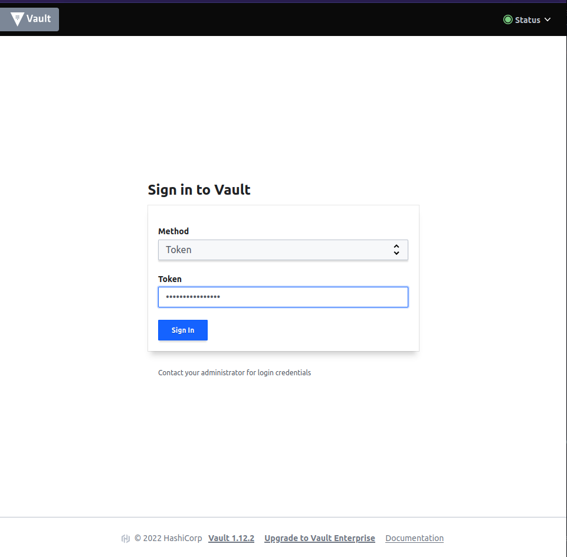

University: [SPBU](https://spbu.ru/)
Faculty: [MM](https://math.spbu.ru/rus/)
Course: [Introduction to distributed technologies](https://github.com/itmo-ict-faculty/introduction-to-distributed-technologies)
Year: 2022/2023
Group: 20.b13-mm
Author: Lurie Lilia Mikhailovna
Lab: Lab1
Date of create: 4.12.2022
Date of finished: -


## Цель работы

Ознакомиться с инструментами Minikube и Docker, развернуть свой первый "под".

## Ход работы

Мной были проделаны следующие действия:
1. Изучена [документация по Minikube](https://minikube.sigs.k8s.io/docs/)
2. Установлен Docker
  ```
 > sudo systemctl status docker
● docker.service - Docker Application Container Engine
     Loaded: loaded (/lib/systemd/system/docker.service; enabled; vendor preset: enabled)
     Active: active (running) since Sun 2022-12-04 21:27:54 MSK; 2min 39s ago
TriggeredBy: ● docker.socket
       Docs: https://docs.docker.com
   Main PID: 474475 (dockerd)
      Tasks: 18
     Memory: 24.7M
        CPU: 254ms
     CGroup: /system.slice/docker.service
             └─474475 /usr/bin/dockerd -H fd:// --containerd=/run/containerd/containerd.sock
```
3. Установлен Minikube
```
> minikube status
minikube
type: Control Plane
host: Running
kubelet: Running
apiserver: Running
kubeconfig: Configured
```
4. Развёрнут minikube cluster
```
> minikube start
😄  minikube v1.28.0 on Ubuntu 22.04
✨  Automatically selected the virtualbox driver. Other choices: none, ssh
💿  Downloading VM boot image ...
    > minikube-v1.28.0-amd64.iso....:  65 B / 65 B [---------] 100.00% ? p/s 0s
    > minikube-v1.28.0-amd64.iso:  274.45 MiB / 274.45 MiB  100.00% 3.36 MiB p/
👍  Starting control plane node minikube in cluster minikube
💾  Downloading Kubernetes v1.25.3 preload ...
    > preloaded-images-k8s-v18-v1...:  385.44 MiB / 385.44 MiB  100.00% 3.45 Mi
🔥  Creating virtualbox VM (CPUs=2, Memory=2200MB, Disk=20000MB) ...
🐳  Preparing Kubernetes v1.25.3 on Docker 20.10.20 ...
    ▪ Generating certificates and keys ...
    ▪ Booting up control plane ...
    ▪ Configuring RBAC rules ...
    ▪ Using image gcr.io/k8s-minikube/storage-provisioner:v5
🔎  Verifying Kubernetes components...
🌟  Enabled addons: storage-provisioner, default-storageclass
🏄  Done! kubectl is now configured to use "minikube" cluster and "default" namespace by default
```
5. Написан манифест для развёртывания пода Hashicorp Vault
```
apiVersion: apps/v1
kind: Deployment
metadata:
	name: vault
spec:
	selector:
		matchLabels:
			app: vault
	template:
		metadata:
			labels:
				app: vault
		spec:
			containers:
			  - name: vault
				image: vault
				resources:
					limits:
						memory: "128Mi"
						cpu: "500m"
				ports:
				  - containerPort: 8200
```

```
> kubectl get all
NAME                         READY   STATUS    RESTARTS   AGE
pod/vault-754d776958-d9nqx   1/1     Running   0          52s

NAME                 TYPE        CLUSTER-IP   EXTERNAL-IP   PORT(S)   AGE
service/kubernetes   ClusterIP   10.96.0.1    <none>        443/TCP   5d21h

NAME                    READY   UP-TO-DATE   AVAILABLE   AGE
deployment.apps/vault   1/1     1            1           52s

NAME                               DESIRED   CURRENT   READY   AGE
replicaset.apps/vault-754d776958   1         1         1       52s
```
6. Создан сервис ля доступа к контейнеру
```
> minikube kubectl -- expose pod vault-754d776958-d9nqx --type=NodePort --port=8200
service/vault-754d776958-d9nqx exposed
```
7. Далее, чтобы попасть в контейнер, я воспользовалась командой
```
> minikube kubectl -- port-forward service/vault-754d776958-d9nqx 8200:8200
Forwarding from 127.0.0.1:8200 -> 8200
Forwarding from [::1]:8200 -> 8200
```
8. Теперь в vault можно было зайти по ссылке [http://localhost:8200](http://localhost:8200)

9. Токен для входа был найден с помощью следующей команды
```
> kubectl logs vault-754d776958-d9nqx
Couldn't start vault with IPC_LOCK. Disabling IPC_LOCK, please use --cap-add IPC_LOCK
==> Vault server configuration:

             Api Address: http://0.0.0.0:8200
                     Cgo: disabled
         Cluster Address: https://0.0.0.0:8201
              Go Version: go1.19.3
              Listener 1: tcp (addr: "0.0.0.0:8200", cluster address: "0.0.0.0:8201", max_request_duration: "1m30s", max_request_size: "33554432", tls: "disabled")
               Log Level: info
                   Mlock: supported: true, enabled: false
           Recovery Mode: false
                 Storage: inmem
                 Version: Vault v1.12.2, built 2022-11-23T12:53:46Z
             Version Sha: 415e1fe3118eebd5df6cb60d13defdc01aa17b03

==> Vault server started! Log data will stream in below:

2022-12-10T16:39:36.316Z [INFO]  proxy environment: http_proxy="" https_proxy="" no_proxy=""
2022-12-10T16:39:36.317Z [WARN]  no `api_addr` value specified in config or in VAULT_API_ADDR; falling back to detection if possible, but this value should be manually set
2022-12-10T16:39:36.319Z [INFO]  core: Initializing version history cache for core
2022-12-10T16:39:36.321Z [INFO]  core: security barrier not initialized
2022-12-10T16:39:36.321Z [INFO]  core: security barrier initialized: stored=1 shares=1 threshold=1
2022-12-10T16:39:36.324Z [INFO]  core: post-unseal setup starting
2022-12-10T16:39:36.347Z [INFO]  core: loaded wrapping token key
2022-12-10T16:39:36.347Z [INFO]  core: Recorded vault version: vault version=1.12.2 upgrade time="2022-12-10 16:39:36.347211185 +0000 UTC" build date=2022-11-23T12:53:46Z
2022-12-10T16:39:36.347Z [INFO]  core: successfully setup plugin catalog: plugin-directory=""
2022-12-10T16:39:36.347Z [INFO]  core: no mounts; adding default mount table
2022-12-10T16:39:36.355Z [INFO]  core: successfully mounted backend: type=cubbyhole version="" path=cubbyhole/
2022-12-10T16:39:36.356Z [INFO]  core: successfully mounted backend: type=system version="" path=sys/
2022-12-10T16:39:36.400Z [INFO]  core: successfully mounted backend: type=identity version="" path=identity/
2022-12-10T16:39:36.408Z [INFO]  core: successfully enabled credential backend: type=token version="" path=token/ namespace="ID: root. Path: "
2022-12-10T16:39:36.410Z [INFO]  rollback: starting rollback manager
2022-12-10T16:39:36.411Z [INFO]  core: restoring leases
2022-12-10T16:39:36.413Z [INFO]  identity: entities restored
2022-12-10T16:39:36.413Z [INFO]  identity: groups restored
2022-12-10T16:39:36.414Z [INFO]  expiration: lease restore complete
2022-12-10T16:39:37.122Z [INFO]  core: post-unseal setup complete
2022-12-10T16:39:37.124Z [INFO]  core: root token generated
2022-12-10T16:39:37.124Z [INFO]  core: pre-seal teardown starting
2022-12-10T16:39:37.125Z [INFO]  rollback: stopping rollback manager
2022-12-10T16:39:37.125Z [INFO]  core: pre-seal teardown complete
2022-12-10T16:39:37.126Z [INFO]  core.cluster-listener.tcp: starting listener: listener_address=0.0.0.0:8201
2022-12-10T16:39:37.126Z [INFO]  core.cluster-listener: serving cluster requests: cluster_listen_address=[::]:8201
2022-12-10T16:39:37.127Z [INFO]  core: post-unseal setup starting
2022-12-10T16:39:37.127Z [INFO]  core: loaded wrapping token key
2022-12-10T16:39:37.127Z [INFO]  core: successfully setup plugin catalog: plugin-directory=""
2022-12-10T16:39:37.129Z [INFO]  core: successfully mounted backend: type=system version="" path=sys/
2022-12-10T16:39:37.129Z [INFO]  core: successfully mounted backend: type=identity version="" path=identity/
2022-12-10T16:39:37.129Z [INFO]  core: successfully mounted backend: type=cubbyhole version="" path=cubbyhole/
2022-12-10T16:39:37.131Z [INFO]  core: successfully enabled credential backend: type=token version="" path=token/ namespace="ID: root. Path: "
2022-12-10T16:39:37.132Z [INFO]  rollback: starting rollback manager
2022-12-10T16:39:37.132Z [INFO]  core: restoring leases
2022-12-10T16:39:37.132Z [INFO]  expiration: lease restore complete
2022-12-10T16:39:37.132Z [INFO]  identity: entities restored
2022-12-10T16:39:37.132Z [INFO]  identity: groups restored
2022-12-10T16:39:37.132Z [INFO]  core: post-unseal setup complete
2022-12-10T16:39:37.133Z [INFO]  core: vault is unsealed
2022-12-10T16:39:37.144Z [INFO]  core: successful mount: namespace="" path=secret/ type=kv version=""
2022-12-10T16:39:37.210Z [INFO]  secrets.kv.kv_ee5bdad6: collecting keys to upgrade
2022-12-10T16:39:37.210Z [INFO]  secrets.kv.kv_ee5bdad6: done collecting keys: num_keys=1
2022-12-10T16:39:37.211Z [INFO]  secrets.kv.kv_ee5bdad6: upgrading keys finished
WARNING! dev mode is enabled! In this mode, Vault runs entirely in-memory
and starts unsealed with a single unseal key. The root token is already
authenticated to the CLI, so you can immediately begin using Vault.

You may need to set the following environment variables:

    $ export VAULT_ADDR='http://0.0.0.0:8200'

The unseal key and root token are displayed below in case you want to
seal/unseal the Vault or re-authenticate.

Unseal Key: V5mV2sTnFJmhfq+eG5dUd2462DXy6zkgZGghlQFPtuE=
Root Token: hvs.wyUUYEqWpS8fsMsFre1jdu3L

Development mode should NOT be used in production installations!
```
10. Осуществлён вход в vault

